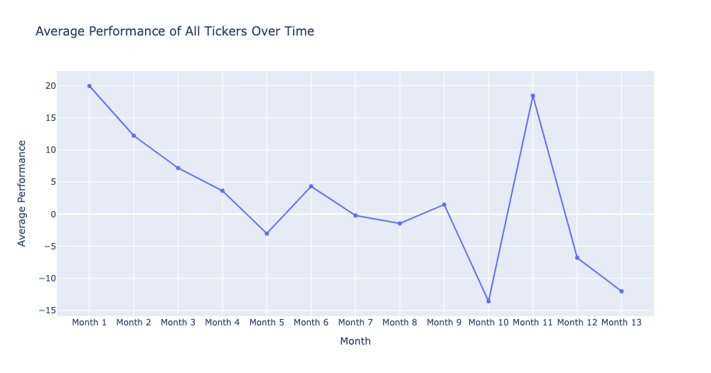
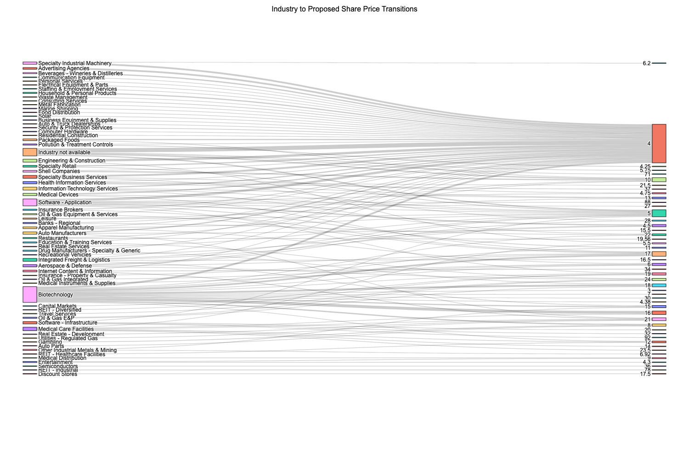
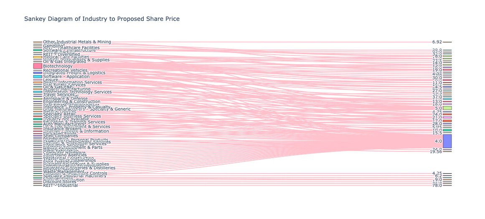

# langgraph-codeact-excel-worker

This repository showcases examples of how to preview, query, and visualize data from Excel files — all powered by LangChain’s new CodeAct agent type!

If you have any questions or would like to collaborate, feel free to reach out to me on [LinkedIn](https://www.linkedin.com/in/jenya-stoeva-60477249/). You're more than welcome!

## What is CodeAct

LangChain's CodeAct agents combine LLM reasoning with code execution, enabling dynamic problem solving through Python code. Rather than just calling predefined tools, CodeAct agents can generate, execute, and revise code on-the-fly using the tools you give them. This means your agent becomes:

* More flexible (able to work around missing tools)
* Safer (code runs in a local sandbox)
* Smarter (can generate multi-step logic, validate outputs, and even create visualizations dynamically)


## How It Works

The repository features 3 examples demonstrating how CodeAct integrates with tools to perform tasks end-to-end. The agent generates Python code to either execute the pre-defined tools or to implement sub-tasks in order to accomplish the given user-defined task.


### ```preview-tool-visualize-codeact```

The agent invokes the ```preview_excel_structure``` tool, then delegates the remaining task execution to the CodeAct mode. Tool usage is enforced by the system prompt.

**Workflow**

* The agent uses the ```preview_excel_structure``` tool to inspect the file, including column names and sample values and then hands over to ```CodeAct``` mode.
* ```CodeAct sub-task``` follows the system prompt instructions to translate the user's question into a DuckDB SQL query based on the detected columns.
* ```CodeAct sub-task``` generates Plotly visualization, considering the user's preferred chart type if specified.
* Finally, the agent displays the result and completes the task only if all steps are successfully executed.




### ```visualize_tools_run_codeact```

The agent invokes all three tools to complete the user task. Tool usage is enforced by the system prompt.

**Workflow**

* First, the agent inspects the Excel file using the ```preview_excel_structure``` tool to identify column names and data types.
* Next, it translates the user input into SQL and executes it using the ```complex_duckdb_query``` tool.
* Finally, if a visualization is requested or deemed useful, the agent uses ```create_visualization``` tool to generate Plotly chart.
* No hand over to ```CodeAct sub-task```.



### ```preview_sql_tools_visualize_codeact```

The agent invokes the ```preview_excel_structure``` & ```complex_duckdb_query``` tools, then delegates the visualization sub-task execution to the CodeAct mode (meaning the agent generates and executes the code to complete the task). Tool usage is enforced by the system prompt.
The output in the ```preview_sql_tools_visualize_codeact``` notebook demonstrates how the agent iteratively attempted to generate a visualization, self-correcting along the way until it succeeded.

**Workflow**

* First, the agent inspects the Excel file using the ```preview_excel_structure``` tool to identify column names and data types.
* Next, it translates the user input into SQL and executes it using the ```complex_duckdb_query``` tool. 
* For the final step, the agent executes ```CodeAct sub-task``` to generate a visualization using Plotly, if requested by the user.




## How-To

To run the agent, find the ```stream_from_agent()``` or ```run_agent()``` function at the end of the notebook. Configure the following:

* ```file_name```: The path to your Excel file (single-sheet only for now)
* ```user_query```: Your question (can include instructions like "ignore tools" or "visualize this")
* ```config```: Default recursion/thread options (already set to safe defaults)
  

## Technical Highlights

* Agent Type: LangChain CodeAct
* LLM: OpenAI gpt-4o
* Execution: Local Python sandbox with eval() and stdout capture
* Data Engine: DuckDB for SQL queries
* Visualization: Plotly Express / Graph Objects


